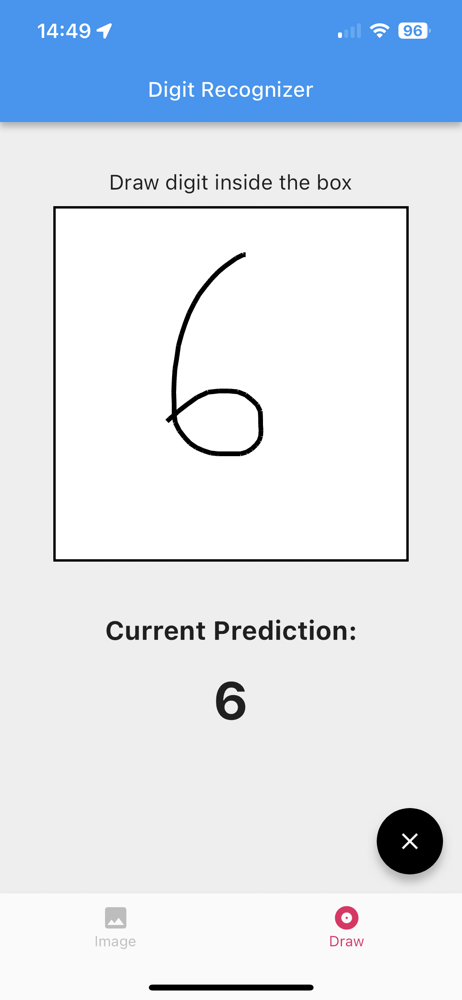
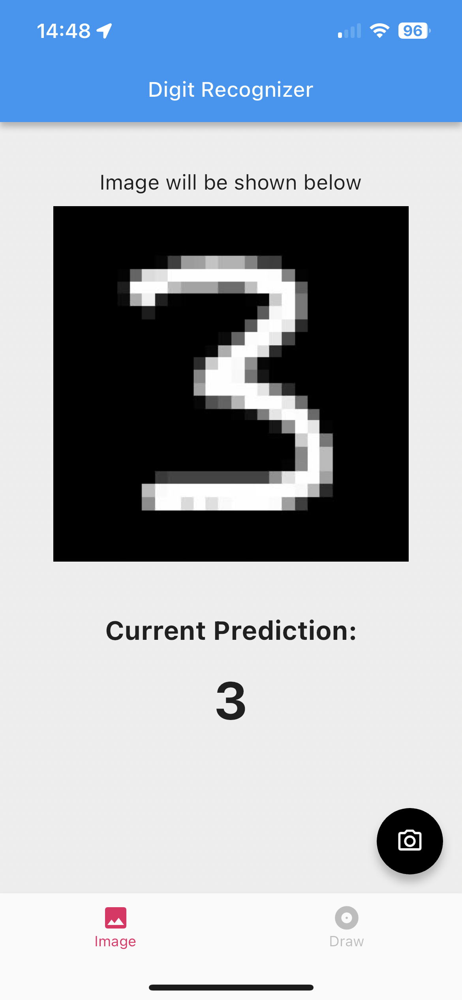

# Handwritten Digit Predictor App

## Description

The Handwritten Digit Predictor is a Flutter-based mobile app that uses a custom machine-learning model to predict handwritten digits. It offers two modes of input: image upload and on-screen drawing, making it a handy tool for digit recognition.

## Usage

1. Launch the app on your device or emulator.

2. Choose a prediction mode:
   - **Image Upload**: Tap the "Image" tab to select an image containing a handwritten digit from your gallery.
   - **On-Screen Drawing**: Tap the "Draw" tab and use the drawing area to draw a digit directly on the screen.

3. The prediction is displayed below the image.

## Screenshots

  
